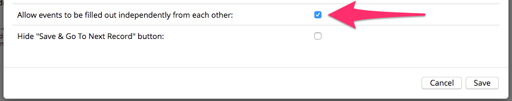
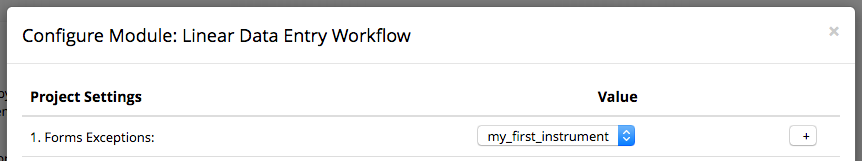
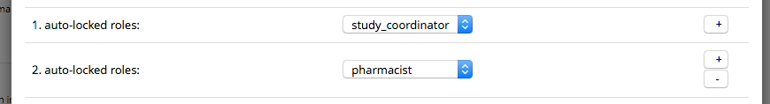

# Linear Data Entry Workflow

This module forces a linear data entry workflow across REDCap forms and events. The linear workflow is enforced by removing access to any form which does not immediately follow the last completed form. In this way, if a user has not filled out the first form, they cannot proceed to the second (or and subsequent) form. This module can be configured at the project level to exclude some forms from these rules.

## Prerequisites
- REDCap >= 8.0.3 (for versions < 8.0.3, [REDCap Modules](https://github.com/vanderbilt/redcap-external-modules) is required).

## Easy Installation
- Obtain this module from the Consortium [REDCap Repo] (https://redcap.vanderbilt.edu/consortium/modules/index.php) from the control center.

## Manual Installation
- Clone this repo into `<redcap-root>/modules/linear_data_entry_workflow_v<version_number>`.
- Go to **Control Center > Manage External Modules** and enable Linear Data Entry Workflow.
- For each project you want to use this module, go to the project home page, click on **Manage External Modules** link, and then enable Linear Data Entry Workflow for that project.

## Features included

### Reveal Forms In Order (RFIO)

This feature operates under the assumption that only complete forms and the immediately ensuing non-complete form should be accessible. For this module, complete is indicated by selecting "Completed" from the completion dropdown.

For example, if you have 3 forms, X, Y, and Z - in that order, and only form X has been completed, then the user can access form X and form Y, but not form Z. Form Z will become available after form Y is complete.

This feature changes REDCap's behavior on 3 pages:

1. **Record Status Dashboard**. Ensures the record status dashboard only reveals forms that should be accessible. It goes through each record, and disables links to all forms that are not complete or immediately following a complete form. If there are multiple events, forms are evaluated one event at a time, with the assumption**\*\*\*** that each event must be completed before any forms on the next event can be accessed. Continuing with the above example: if forms X, Y, and Z are designated for both a January and February event, January's form Z must be complete before the user can fill out February X.
2. **Record Home**. Performs much the same function as described above, but on an individual record's home page. This means that each event is evaluated separately, and the form immediately ensuing the last complete form is the last accessible form.
3. **Data Entry Form**. Prevents users from using the left hand sidebar links to navigate to forms that should be inaccessible.

**\*\*\*** If this assumption is false for your project, access **Manage External Modules** section of your project, click on Linear Data Entry Workflow's configurtion button, and check "Allow events to be filled out independently from each other" (see image below).

### Force Data Entry Constraints (FDEC)

This feature prevents users from marking a form as complete if the required fields are not filled in. Additionally, field verifications must be satisfied before the form can be marked `Completed`.

For example, if the field 'Age' requires a number from 0 to 99 and the user enters 'fifty' the form cannot be marked as complete. If the user attempts to mark the form complete with an empty field or unverified field, a popup window will direct them to the field(s) that need to be adjusted before they can mark the form complete.

### Adding exceptions
Linear Data Entry Workflow can be configured to ignore certain forms. To do that, access **Manage External Modules** section of your project, click on Linear Data Entry Workflow's configurtion button, and fill **Forms Exceptions** field.

### Suppressing "Save & Go To Next Record"

In a clinical data collection workflow the study coordinator is likely working with only one research participant at a time. In this case the "Save & Go To Next Record" button might be a distraction. This button can be hidden via the modules project-level configuration option _Hide "Save & Go To Next Record" button_

### Auto-locking forms
Linear Data Entry Workflow can be configured to automatically lock forms upon completion for certain user roles. These roles will not have the ability to unlock these forms on their own. For this feature to work properly the role must have Lock/Unlock privileges.

This can be configured in the **User Rights** page. To activate this feature access **Manage External Modules** section of your project, click on Linear Data Entry Workflow's configure button, and select a role to activate auto-locking on. Please note that this feature does not affect REDCap administrators, regardless of what role they are in.

